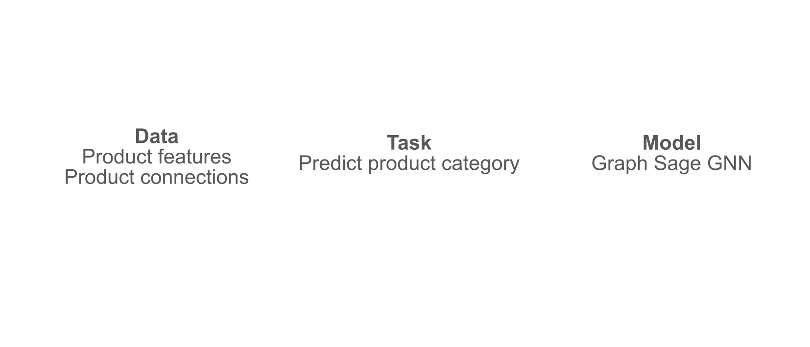
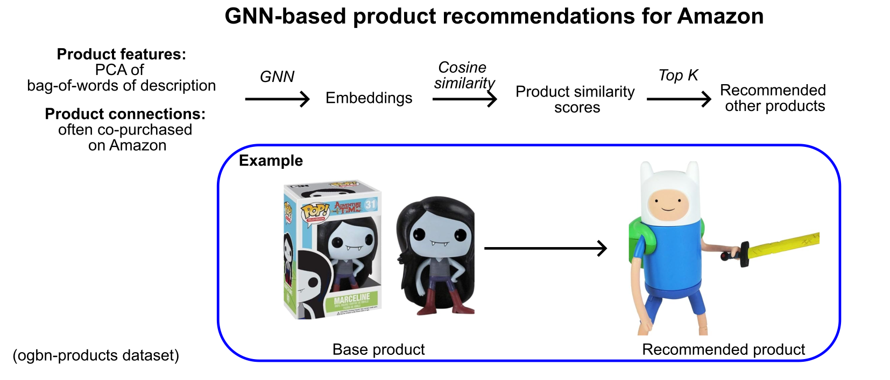

Use a Graph Neural Network (GNN) to recommend products from obgn-products dataset of Amazon products.
Based on Graph neural networks in Action by Broadwater and Stillman.

Train GNN:

Get recommendations:

